---
## Front matter
lang: ru-RU
title: Лабораторная работа №3
subtitle: Планирование локальной сети организации
author:
  - Хрусталев В.Н.
institute:
  - Российский университет дружбы народов, Москва, Россия

## i18n babel
babel-lang: russian
babel-otherlangs: english

## Formatting pdf
toc: false
toc-title: Содержание
slide_level: 2
aspectratio: 169
section-titles: true
theme: metropolis
header-includes:
 - \metroset{progressbar=frametitle,sectionpage=progressbar,numbering=fraction}
---

# Информация

## Докладчик

:::::::::::::: {.columns align=center}
::: {.column width="100%"}

  * Хрусталев Влад Никоалевич
  * студент
  * Российский университет дружбы народов
  * [1132222011@pfur.ru](mailto:1132222011@pfur.ru)
  * <https://vnkhrustalev.github.io/ru/>

::::::::::::::

## Цель работы

Познакомиться с принципами планирования локальной сети организации.

## Задание

1. Используя графический редактор (например, Dia), требуется повторить схемы L1, L2, L3, а также сопутствующие им таблицы VLAN, IP-адресов и портов подключения оборудования планируемой сети.

2. Рассмотренный выше пример планирования адресного пространства сети базируется на разбиении сети 10.128.0.0\/16 на соответствующие подсети.
Требуется сделать аналогичный план адресного пространства для сетей 172.16.0.0\/12 и 192.168.0.0\/16 с соответствующими схемами сети и сопутствующими таблицами VLAN, IP-адресов и портов подключения оборудования.

3. При выполнении работы необходимо учитывать соглашение об именовании

## Выполнение лабораторной работы (Часть 1)

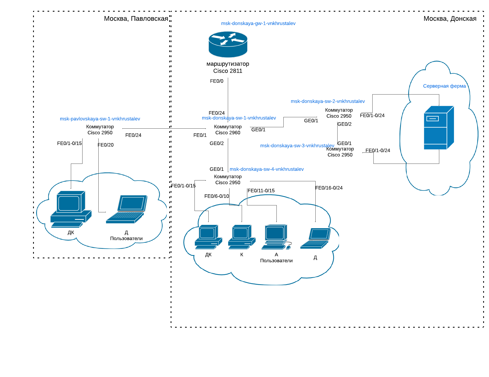{#fig:001 width=70%}

## Выполнение лабораторной работы (Часть 1)

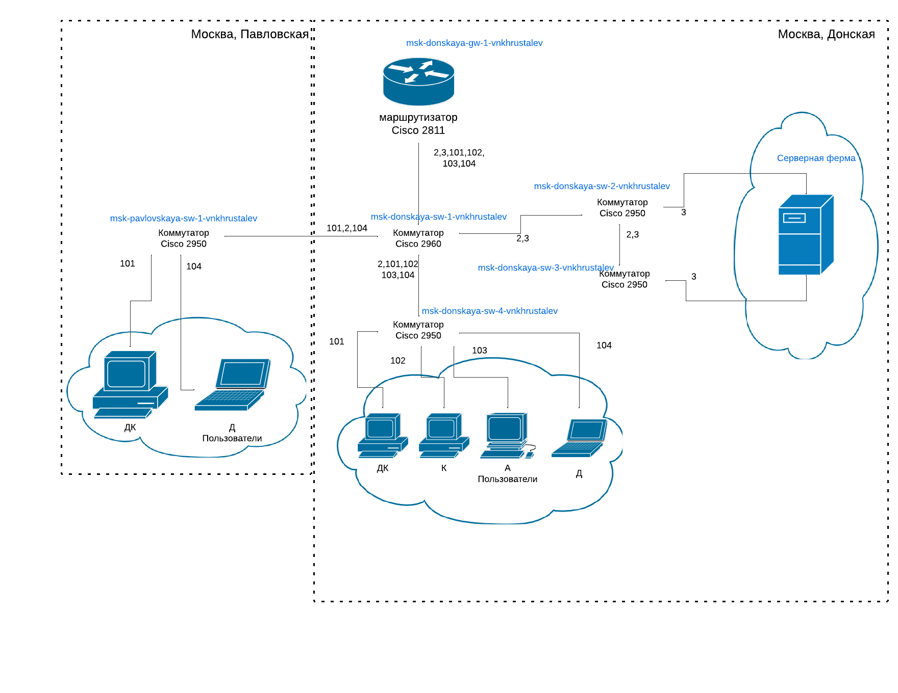{#fig:002 width=70%}

## Выполнение лабораторной работы (Часть 1)

{#fig:003 width=70%}

## Выполнение лабораторной работы (Часть 1)

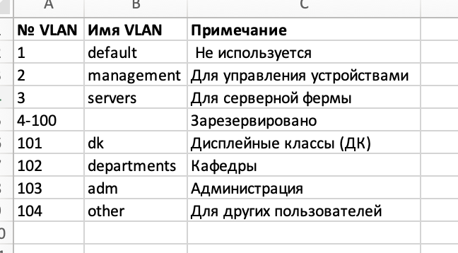{#fig:004 width=70%}

## Выполнение лабораторной работы (Часть 1)

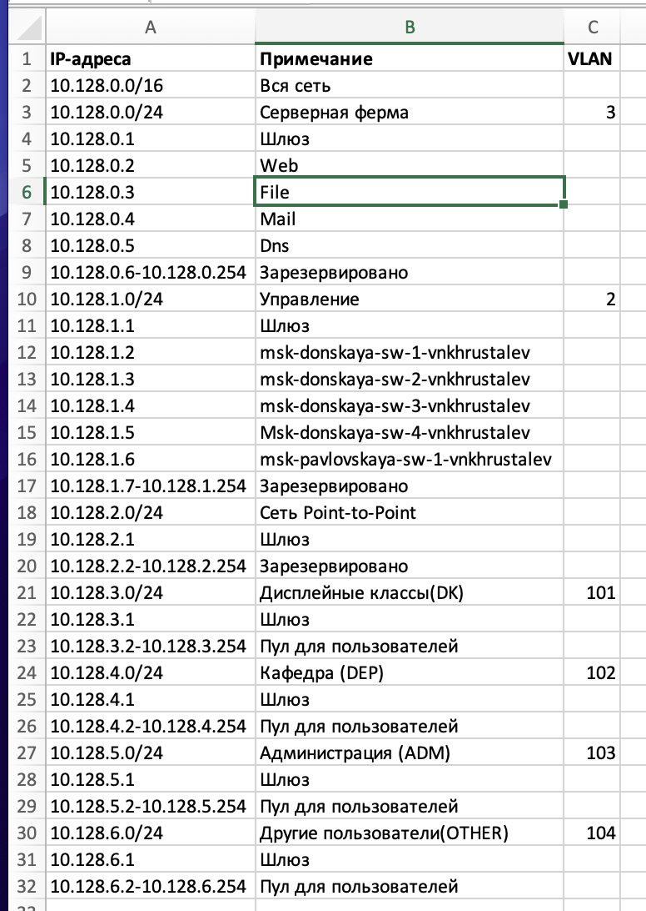{#fig:005 width=70%}

## Выполнение лабораторной работы (Часть 1)

{#fig:006 width=70%}

## Выполнение лабораторной работы (Часть 1)

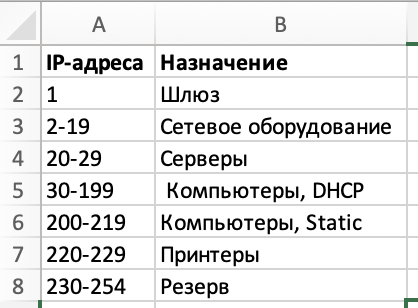{#fig:007 width=70%}

## Выполнение лабораторной работы (Часть 2) для сети 172.16.0.0/12  

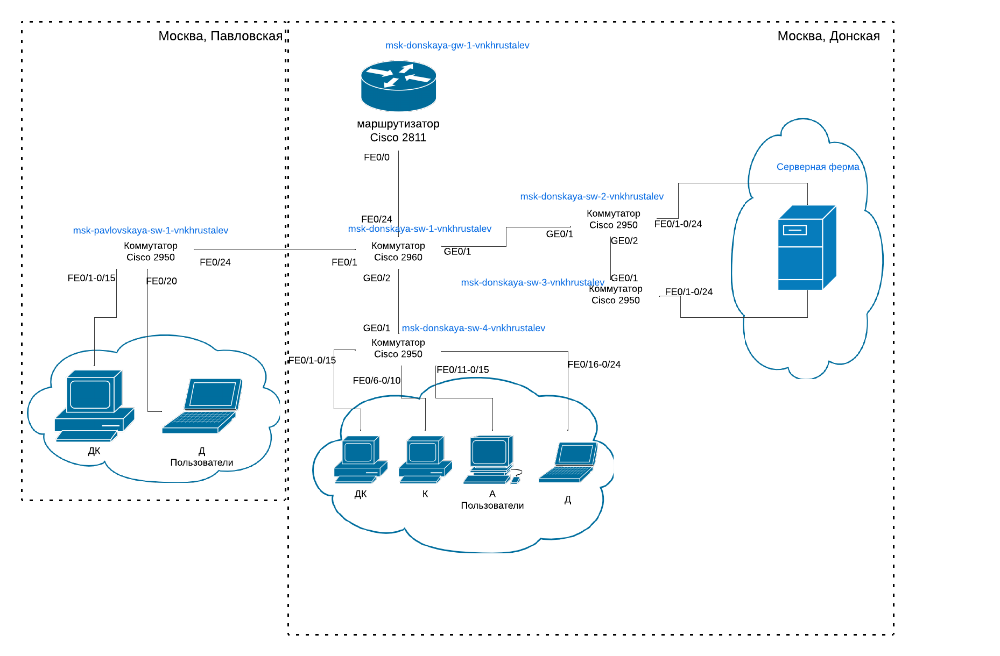{#fig:008 width=70%}

## Выполнение лабораторной работы (Часть 2) для сети 172.16.0.0/12  

{#fig:009 width=70%}

## Выполнение лабораторной работы (Часть 2) для сети 172.16.0.0/12  

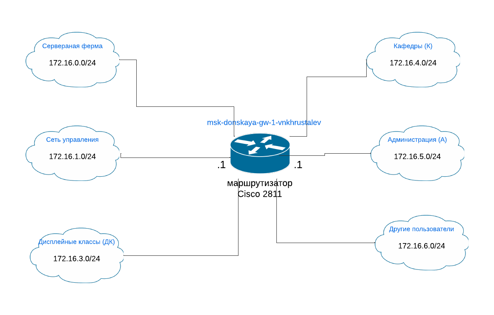{#fig:010 width=70%}

## Выполнение лабораторной работы (Часть 2) для сети 172.16.0.0/12  

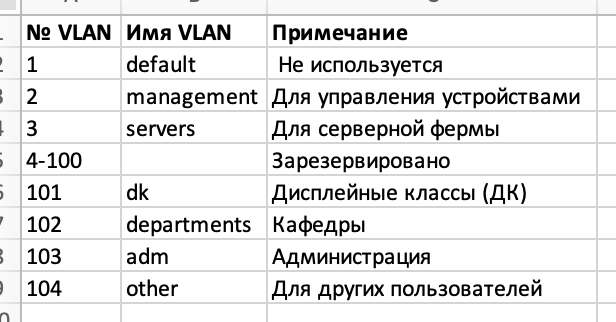{#fig:011 width=70%}

## Выполнение лабораторной работы (Часть 2) для сети 172.16.0.0/12  

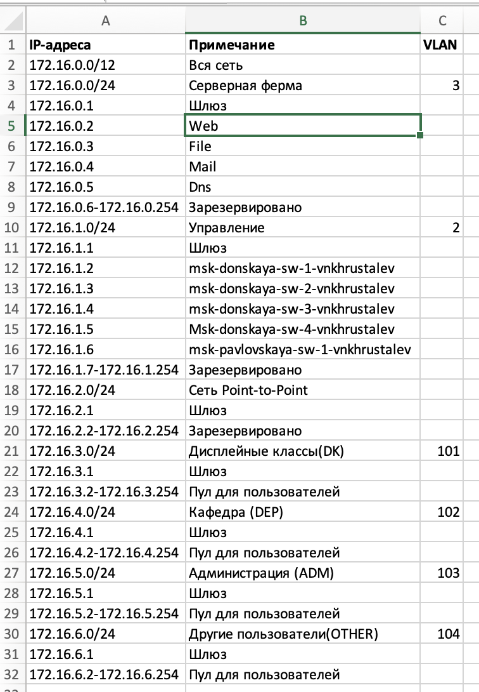{#fig:012 width=70%}

## Выполнение лабораторной работы (Часть 2) для сети 172.16.0.0/12  

{#fig:013 width=70%}

## Выполнение лабораторной работы (Часть 2) для сети 192.168.0.0/16

{#fig:014 width=70%}

## Выполнение лабораторной работы (Часть 2) для сети 192.168.0.0/16

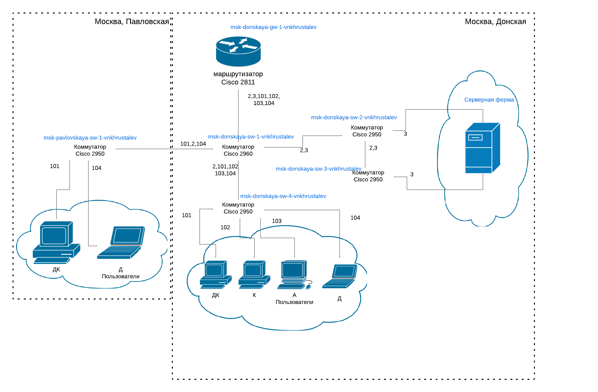{#fig:015 width=70%}

## Выполнение лабораторной работы (Часть 2) для сети 192.168.0.0/16

{#fig:016 width=70%}

## Выполнение лабораторной работы (Часть 2) для сети 192.168.0.0/16

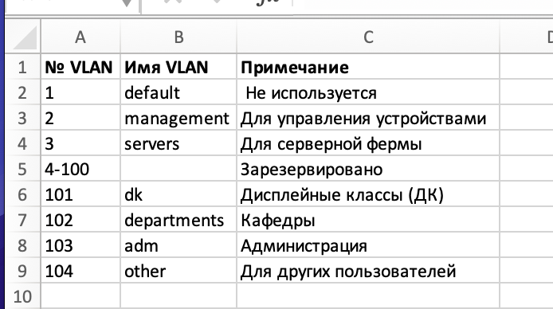{#fig:017 width=70%}

## Выполнение лабораторной работы (Часть 2) для сети 192.168.0.0/16

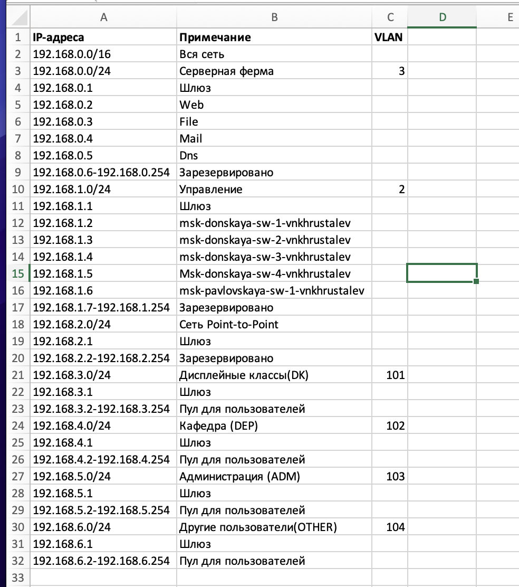{#fig:018 width=70%}

## Выполнение лабораторной работы (Часть 2) для сети 192.168.0.0/16

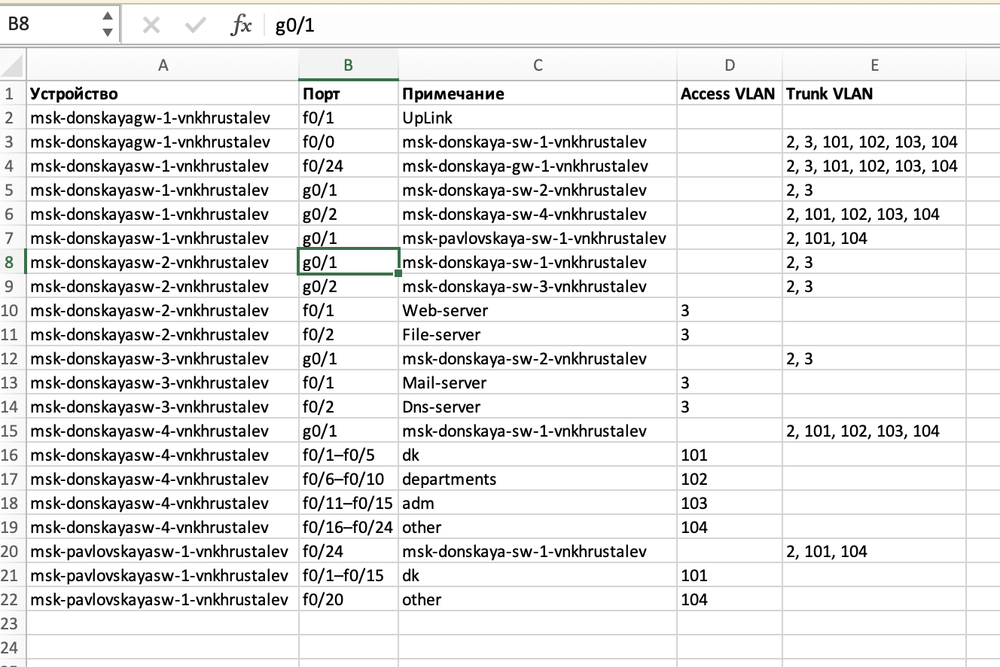{#fig:019 width=70%}

## Вывод

В процессе выполнения лабораторной работы я познакомилась с принципами планирования локальной сети организации.

