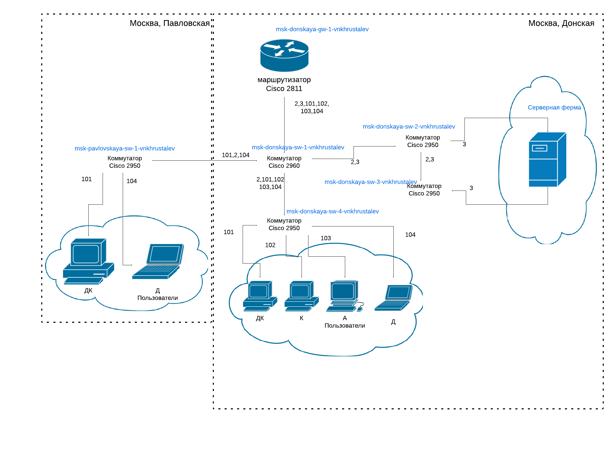
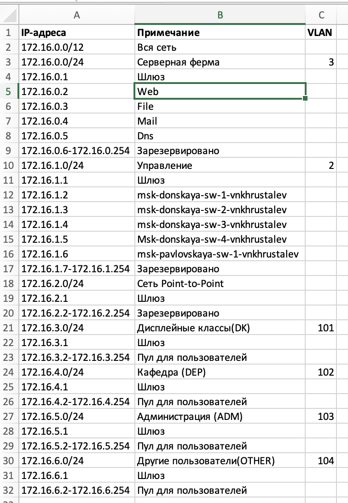

---
## Front matter
title: "Лабораторная работа №3"
subtitle: "Планирование локальной сети организации"
author: "Хрусталев Влад Николаевич"

## Generic otions
lang: ru-RU
toc-title: "Содержание"

## Bibliography
bibliography: bib/cite.bib
csl: pandoc/csl/gost-r-7-0-5-2008-numeric.csl

## Pdf output format
toc: true # Table of contents
toc-depth: 2
lof: true # List of figures
lot: true # List of tables
fontsize: 12pt
linestretch: 1.5
papersize: a4
documentclass: scrreprt
## I18n polyglossia
polyglossia-lang:
  name: russian
  options:
	- spelling=modern
	- babelshorthands=true
polyglossia-otherlangs:
  name: english
## I18n babel
babel-lang: russian
babel-otherlangs: english
## Fonts
mainfont: IBM Plex Serif
romanfont: IBM Plex Serif
sansfont: IBM Plex Sans
monofont: IBM Plex Mono
mathfont: STIX Two Math
mainfontoptions: Ligatures=Common,Ligatures=TeX,Scale=0.94
romanfontoptions: Ligatures=Common,Ligatures=TeX,Scale=0.94
sansfontoptions: Ligatures=Common,Ligatures=TeX,Scale=MatchLowercase,Scale=0.94
monofontoptions: Scale=MatchLowercase,Scale=0.94,FakeStretch=0.9
mathfontoptions:
## Biblatex
biblatex: true
biblio-style: "gost-numeric"
biblatexoptions:
  - parentracker=true
  - backend=biber
  - hyperref=auto
  - language=auto
  - autolang=other*
  - citestyle=gost-numeric
## Pandoc-crossref LaTeX customization
figureTitle: "Рис."
tableTitle: "Таблица"
listingTitle: "Листинг"
lofTitle: "Список иллюстраций"
lotTitle: "Список таблиц"
lolTitle: "Листинги"
## Misc options
indent: true
header-includes:
  - \usepackage{indentfirst}
  - \usepackage{float} # keep figures where there are in the text
  - \floatplacement{figure}{H} # keep figures where there are in the text
---

# Цель работы

Познакомиться с принципами планирования локальной сети организации.

# Задание

1. Используя графический редактор (например, Dia), требуется повторить схемы L1, L2, L3, а также сопутствующие им таблицы VLAN, IP-адресов и портов подключения оборудования планируемой сети.

2. Рассмотренный выше пример планирования адресного пространства сети базируется на разбиении сети 10.128.0.0\/16 на соответствующие подсети.
Требуется сделать аналогичный план адресного пространства для сетей 172.16.0.0\/12 и 192.168.0.0\/16 с соответствующими схемами сети и сопутствующими таблицами VLAN, IP-адресов и портов подключения оборудования.

3. При выполнении работы необходимо учитывать соглашение об именовании

# Выполнение лабораторной работы

## Часть 1

Используя графический редактор, в моём случае это LucidChart, повторим схемы L1 (рис. [-@fig:001]), L2 (рис. [-@fig:002]), L3 (рис. [-@fig:003]), а также сопутсвующие таблицы VLAN (рис. [-@fig:004]), IP-адрессов(рис. [-@fig:005]) и портов подключения оборудования (рис. [-@fig:006]).

В качестве оборудования уровня ядра будем использовать маршрутизатор
Cisco 2811, на уровне распределения — коммутаторы Cisco 2960 с возможностью
настройки VLAN, а на уровне доступа — коммутаторы Cisco 2950.

{#fig:001 width=70%}

{#fig:002 width=70%}

{#fig:003 width=70%}

{#fig:004 width=70%}

{#fig:005 width=70%}

{#fig:006 width=70%}

Так же и регламент выделения ip-адресов (рис. [-@fig:007]).

{#fig:007 width=70%}

## Часть 2

Теперь сделаем аналогичный план адресного пространства для сети 172.16.0.0/12  схемы L1 (рис. [-@fig:008]), L2 (рис. [-@fig:009]), L3 (рис. [-@fig:010]), а также сопутсвующие таблицы VLAN (рис. [-@fig:011]), IP-адрессов(рис. [-@fig:012]) и портов подключения оборудования (рис. [-@fig:013]).

{#fig:008 width=70%}

{#fig:009 width=70%}

{#fig:010 width=70%}

{#fig:011 width=70%}

{#fig:012 width=70%}

{#fig:013 width=70%}

Теперь сделаем аналогичный план адресного пространства для сети 192.168.0.0/16 схемы L1 (рис. [-@fig:014]), L2 (рис. [-@fig:015]), L3 (рис. [-@fig:016]), а также сопутсвующие таблицы VLAN (рис. [-@fig:017]), IP-адрессов(рис. [-@fig:018]) и портов подключения оборудования (рис. [-@fig:019]).

{#fig:014 width=70%}

{#fig:015 width=70%}

{#fig:016 width=70%}

{#fig:017 width=70%}

{#fig:018 width=70%}

{#fig:019 width=70%}

## Ответы на котрольные вопросы

1. **Модель взаимодействия открытых систем (OSI)** — это семиуровневая концептуальная модель сетевого взаимодействия. Уровни:
   - **Физический (Physical)** – передача битов через среду передачи.
   - **Канальный (Data Link)** – формирование кадров, управление доступом к среде.
   - **Сетевой (Network)** – маршрутизация, IP-адресация.
   - **Транспортный (Transport)** – сегментация данных, управление потоком.
   - **Сеансовый (Session)** – управление сеансами связи.
   - **Представления (Presentation)** – кодирование, сжатие, шифрование данных.
   - **Прикладной (Application)** – взаимодействие с приложениями.

2. **Функции коммутатора:**
   - Передача данных между устройствами внутри сети.
   - Разделение сети на сегменты, снижение коллизий.
   - Поддержка VLAN для логического разделения сетей.

3. **Функции маршрутизатора:**
   - Определение оптимального маршрута передачи данных.
   - Соединение различных сетей.
   - Использование NAT, DHCP, межсетевого экранирования.

4. **Отличие коммутаторов 2-го и 3-го уровня:**
   - **Коммутаторы 2 уровня** работают на канальном уровне, используют MAC-адреса.
   - **Коммутаторы 3 уровня** выполняют маршрутизацию на сетевом уровне, используют IP-адреса.

5. **Сетевой интерфейс** – программно-аппаратный компонент, обеспечивающий взаимодействие с сетью (например, Ethernet-карта, Wi-Fi-адаптер).

6. **Сетевой порт** – точка подключения в устройстве для передачи данных (RJ-45, оптические порты, виртуальные порты).

7. **Ethernet, Fast Ethernet, Gigabit Ethernet:**
   - **Ethernet (10 Мбит/с)** – первая версия технологии.
   - **Fast Ethernet (100 Мбит/с)** – улучшенная версия.
   - **Gigabit Ethernet (1 Гбит/с и выше)** – современный стандарт для высокоскоростных сетей.

8. **IPv4-адрес** – 32-битный адрес для идентификации устройства в сети.  
   - **Сеть** – группа узлов с общим IP-префиксом.
   - **Подсеть** – логически выделенная часть сети.
   - **Маска подсети** – определяет, какая часть адреса относится к сети, а какая – к узлу.
   - **Служебные IP-адреса:**  
     - **0.0.0.0** – неопределенный адрес.
     - **255.255.255.255** – широковещательный адрес.
     - **127.0.0.1** – localhost (тестирование).  
   - **Пример разбиения сети**:  
     Сеть `192.168.1.0/24` (256 адресов) можно разделить на две подсети `192.168.1.0/25` (128 адресов) и `192.168.1.128/25` (128 адресов).

9. **VLAN (Virtual LAN)** – логическое разделение сети на сегменты.  
   - **Применение:** разделение пользователей по отделам, обеспечение безопасности.  
   - **Преимущества:** снижение широковещательного трафика, улучшение безопасности.  
   - **Пример:** VLAN для бухгалтерии, технического отдела и отдела продаж.

10. **Разница между Trunk Port и Access Port:**
   - **Access Port** – передает трафик только одной VLAN.
   - **Trunk Port** – может передавать трафик нескольких VLAN, используя тегирование (802.1Q).

# Выводы

В ходе выполнения лабораторной работы мы познакомились с принципами планирования локальной сети организации.

# Список литературы{.unnumbered}

::: {#refs}
:::
